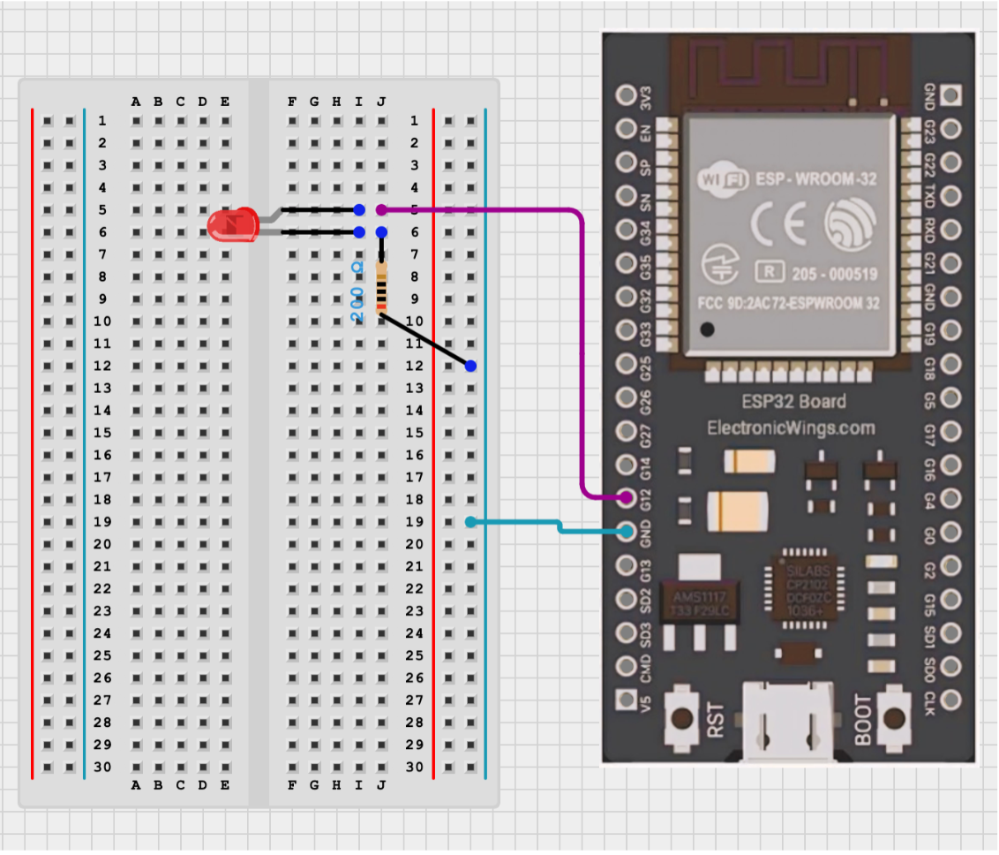

## Introduction

First of all, thank you for attending the esp32 workshop!  
The following will be an appendix for the workshop which will go through each part of the code in more detail and outline some other important concepts so you can work with the ESP32 with confidence.  
The guide assumes that you have a working ESP32 Wroom connected to your computer and the arduino IDE installed, which can be downloaded at [arduino.cc](https://www.arduino.cc/en/software).
  
### TOC
- [Introduction](#introduction)
  - [TOC](#toc)
- [Setup](#setup)
  - [Install ESP32 Board](#install-esp32-board)
  - [Install the Libraries](#install-the-libraries)
  - [Connect to the ESP32](#connect-to-the-esp32)
- [LED Demo](#led-demo)
  - [Blink Demo](#blink-demo)
  - [Setting up WebServer](#setting-up-webserver)
  - [HTML and JS for the LED](#html-and-js-for-the-led)
  - [Final Code](#final-code)
- [Appendix](#appendix)
  - [AsyncWebServer](#asyncwebserver)
  - [AsyncWebSocket](#asyncwebsocket)

## Setup

This section will guide you on how to setup your ESP32 so that you can use it with your computer.    
  
### Install ESP32 Board
First we have to install the board to ensure that our computer can communicate with the ESP32. 
1. Go to preferences.
2. Click the button next to *Additional boards manager URLS*.
3. In a new line, paste `https://raw.githubusercontent.com/espressif/arduino-esp32/gh-pages/package_esp32_index.json`
4. On the left hand side, click on the board manager icon (should be the second one from the top).
5. Search *ESP32* and install *esp32 by Espressif Systems*.

### Install the Libraries
Now that we have installed the board for the ESP32, we have to install the libraries that we will be using.  
1. On the left hand side, click the libraries icon (should be the third one from the top and looks like a row of boooks).
2. Search *ESPAsyncWebServer* and install the one by *ESP32Async*.
3. Search *ESPAsyncTCP* and install the one by *ESP32Async*.

### Connect to the ESP32
Finally, we have installed all we need to make a webserver on the ESP32. All that's left is actually connecting the computer to the ESP32.
1. Plug in the ESP32 into the computer.
2. Click on the connection at the top of the IDE and click *Select other board or port...*
3. For the board, search and select *uPesy ESP32 Wroom DevKit*.
4. For the Port, if you are on Windows, select the Com with USB next to it. If you are on Mac, select the Com with ttl/usb next to it.

Now the ESP32 is connected to our computer with all the proper software. All that's left is to start coding!

## LED Demo
In this section, we will be running a simple web server to turn on and off an LED using a website. During this section, the various concepts of Web servers and Web sockets will be introduced in a project based environment. If you need any more information about Webservers or sockets look at the Appendix for extra resources.

### Blink Demo
Before we even start, let's just test that the ESP32 works and send it a basic blink demo.  
First, wire the ESP32 as you see below.  

  

Then, copy paste the code below into the arduino ide and upload it.
```cpp
int LED_BUILTIN = 12;

void setup() {
    pinMode (LED_BUILTIN, OUTPUT);
}

void loop() {
    digitalWrite(LED_BUILTIN, HIGH);
    delay(1000);
    digitalWrite(LED_BUILTIN, LOW);
    delay(1000);
}
```
Now you should have a blinking LED on your breadboard.

### Setting up WebServer
Before writing the actual server code, we need some basic code to setup the LED and the connection with the ESP32.
```cpp
// Imports needed 
#include <WiFi.h>
#include <AsyncTCP.h>
#include <ESPAsyncWebServer.h>

// Set up the LED state (whether the led is on or off) and the GPIO pin for the LED
bool ledState = 0;
const int ledPin = 12;

// A default function that runs once when the MCU first runs the code
void setup() {
    // Starts the Serial connection between the ESP and computer at 115200Hz
    Serial.begin(115200);

    // Set that the LED pin is for output
    pinMode(ledPin, OUTPUT);
    // Set the output of the LED pin to low
    digitalWrite(ledPin, LOW);
}

// A default function that runs continuously after the setup function until the MCU running
void loop() {
}
```
Now onto the basic server code.
```cpp
...
// Stores the wifi name. Replace <Wifi-Name> with you wifi's name. DO NOT USE UofT WIFI! It won't work, use a hotspot.
const char *ssid = "<Wifi-Name>";

// Stores the wifi password. Replace <Password> with your wifi's password
const char *password = "<Password>";

// The actual web server and the socket that goes along with it
AsyncWebServer server(80);
AsyncWebSocket ws("/ws");

void setup() {
    ...

    // Prints what connection the server is connecting to 
    Serial.println("Connecting to ");
    Serial.println(ssid);

    // Start the wifi connection with the wifi name and password
    Wifi.begin(ssid, password);

    // Wait until we are connected to the wifi
    while(WiFi.status() != WL_CONNECTED) {
        delay(1000);
        Serial.print(".");
    }

    // Let the user know that the server is connected to the wifi and the ip address of the server
    Serial.println("");
    Serial.println("Connected..!");
    Serial.print("Got IP: ");
    Serial.println(WiFi.localIP());
    ...
}
...
```
You can see more information about the [AsyncWebServer](#asyncwebserver) and [AsyncWebSocket](#asyncwebsocket) in the appendix.  
Next, we will start handling requests that the server is receiving.
```cpp
...

// Handles the messages that a web socket receives
void handleWebSocketMessage(void *arg, uint8_t *data, size_t len) {

    // Stores the information being sent
    // More information about what a frame is and what it stores is in the appendix
    AwsFrameInfo *info = (AwsFrameInfo *)arg;
    // Checks to make sure that the information sent is text
    if (info->final && info->index == 0 && info->len == len && info->opcode == WS_TEXT) {
      data[len] = 0;

      // Checks to see if the data sent is the toggle word
      if (strcmp((char *)data, "toggle") == 0) {
        // Updates LED state
        ledState = !ledState;

        // Sends a message back to the client
        ws.textAll(String(ledState));
      }
    }
}

// Processes the HTML (that will be mentioned in the next section) and replaces the variables with % around them with the String returned (Example: %STATE% will be replaced with ON or OFF) 
String processor(const String &var) {
    if (var == "STATE") {
        return ledState ? "ON" : "OFF";
    }
    if (var == "CHECK") {
        return ledState ? "checked" : "";
    }
    return String();
}


// A function that deals with events that are coming into the web socket
void eventHandler(AsyncWebSocket *server, AsyncWebSocketClient *client, AwsEventType type, void *arg, uint8_t *data, size_t len) {

    // Deals with different types of events
  switch (type) {

    // A connection event
    case WS_EVT_CONNECT:
        Serial.printf("WebSocket client #%u connected from %s\n", client->id(), client->remoteIP().toString().c_str());
        break;

    // A disconnect event
    case WS_EVT_DISCONNECT:
        Serial.printf("WebSocket client #%u disconnected\n", client->id());
        break;

    // An event where data is being sent
    case WS_EVT_DATA:
        // Handle the data sent from the web socket in another function and update the LED's state
        handleWebSocketMessage(arg, data, len);
        digitalWrite(ledPin, ledState);
        break;
  }
}

void setup() {
    ...
    // Sets up the handler for the web socket
    ws.onEvent(eventHandler);
    // Sets up the handler for the server
    server.addHandler(&ws);

    // Routes / (the default adress of the website) to a specific page (index_html) after being processed (processor) with a success error code (200)
    server.on("/", HTTP_GET, [](AsyncWebServerRequest *request) {
        request->send_P(200, "text/html", index_html, processor);
    });

    // Starts the server
    server.begin();
}

void loop() {
    // Removes any connections that are closed
    ws.cleanupClients();
}
...
```
A lot of this code is probably very confusing, which is normal as there is a lot of background knowledge about networking, severs, and websockets needed. However, start by going through the setup function and for anything that you don't understand, look at the appendix.

### HTML and JS for the LED
Finally, we will add the index_html that was in the previous code:
```html
const char index_html[] PROGMEM = R"rawliteral(
<!DOCTYPE html>
<html>
  <head>
    <meta name="viewport" content="width=device-width, initial-scale=1.0, user-scalable=no">
    <title>ESP32 WebSocket Server</title>
    <style>
    html{font-family: Helvetica; display: inline-block; margin: 0px auto; text-align: center;}
    body{margin-top: 50px;}
    h1{color: #444444;margin: 50px auto;}
    p{font-size: 19px;color: #888;}
    #state{font-weight: bold;color: #444;}
    .switch{margin:25px auto;width:80px}
    .toggle{display:none}
    .toggle+label{display:block;position:relative;cursor:pointer;outline:0;user-select:none;padding:2px;width:80px;height:40px;background-color:#ddd;border-radius:40px}
    .toggle+label:before,.toggle+label:after{display:block;position:absolute;top:1px;left:1px;bottom:1px;content:""}
    .toggle+label:before{right:1px;background-color:#f1f1f1;border-radius:40px;transition:background .4s}
    .toggle+label:after{width:40px;background-color:#fff;border-radius:20px;box-shadow:0 2px 5px rgba(0,0,0,.3);transition:margin .4s}
    .toggle:checked+label:before{background-color:#4285f4}
    .toggle:checked+label:after{margin-left:42px}
    </style>
  </head>
  <body>
    <h1>ESP32 WebSocket Server</h1>
    <div class="switch">
      <input id="toggle-btn" class="toggle" type="checkbox" %CHECK%>
      <label for="toggle-btn"></label>
    </div>
    <p>On-board LED: <span id="state">%STATE%</span></p>
  </body>
</html>
<!----------------------- THE IMPORTANT PART -------------------->
<script>
    // We add an event listener so that when the website first loads, the websocket is started with the server
	  window.addEventListener('load', function() {

        // Initialize the server with its URI (remember the "/ws" we put in the websocket's constructor in the esp32 code)
		var websocket = new WebSocket(`ws://${window.location.hostname}/ws`);
        
        // Action the websocket will take when the connection is opened
		websocket.onopen = function(event) {
		  console.log('Connection established');
		}

        // Action the websocket will take when the connection is closed
		websocket.onclose = function(event) {
		  console.log('Connection died');
		}

        // Action the websocket will take when there is an error
		websocket.onerror = function(error) {
		  console.log('error');
		};

        // Action the websocket will take when it receives a message
		websocket.onmessage = function(event) {
            // Checks what data was send (the current state of the LED) and flips it
		    if (event.data == "1") {
			    document.getElementById('state').innerHTML = "ON";
			    document.getElementById('toggle-btn').checked = true;
		    }
		    else {
			    document.getElementById('state').innerHTML = "OFF";
			    document.getElementById('toggle-btn').checked = false;
		    }
		};
		
        // Makes the toggle button send a message to the server to toggle
		document.getElementById('toggle-btn').addEventListener('change', function() { websocket.send('toggle'); });
	  });
	</script>
)rawliteral";
```
This tutorial is not meant to teach you HTML or JavaScript and as such there will not be too much detail on this. However, you can find more information on the websocket API at [MDN](https://developer.mozilla.org/en-US/docs/Web/API/WebSockets_API).

### Final Code
Here's the final code:
```cpp
#include <WiFi.h>
#include <AsyncTCP.h>
#include <ESPAsyncWebServer.h>

bool ledState = 0;
const int ledPin = 12;

const char* ssid = "<Wifi-Name>";
const char* password = "<Password-name>";

AsyncWebServer server(80);
AsyncWebSocket ws("/ws");

const char index_html[] PROGMEM = R"rawliteral(
<!DOCTYPE html>
<html>
  <head>
    <meta name="viewport" content="width=device-width, initial-scale=1.0, user-scalable=no">
    <title>ESP32 WebSocket Server</title>
    <style>
    html{font-family: Helvetica; display: inline-block; margin: 0px auto; text-align: center;}
    body{margin-top: 50px;}
    h1{color: #444444;margin: 50px auto;}
    p{font-size: 19px;color: #888;}
    #state{font-weight: bold;color: #444;}
    .switch{margin:25px auto;width:80px}
    .toggle{display:none}
    .toggle+label{display:block;position:relative;cursor:pointer;outline:0;user-select:none;padding:2px;width:80px;height:40px;background-color:#ddd;border-radius:40px}
    .toggle+label:before,.toggle+label:after{display:block;position:absolute;top:1px;left:1px;bottom:1px;content:""}
    .toggle+label:before{right:1px;background-color:#f1f1f1;border-radius:40px;transition:background .4s}
    .toggle+label:after{width:40px;background-color:#fff;border-radius:20px;box-shadow:0 2px 5px rgba(0,0,0,.3);transition:margin .4s}
    .toggle:checked+label:before{background-color:#4285f4}
    .toggle:checked+label:after{margin-left:42px}
    </style>
  </head>
  <body>
    <h1>ESP32 WebSocket Server</h1>
    <div class="switch">
      <input id="toggle-btn" class="toggle" type="checkbox" %CHECK%>
      <label for="toggle-btn"></label>
    </div>
    <p>On-board LED: <span id="state">%STATE%</span></p>
  </body>
</html>

<script>
	  window.addEventListener('load', function() {
		var websocket = new WebSocket(`ws://${window.location.hostname}/ws`);
		websocket.onopen = function(event) {
		  console.log('Connection established');
		}
		websocket.onclose = function(event) {
		  console.log('Connection died');
		}
		websocket.onerror = function(error) {
		  console.log('error');
		};
		websocket.onmessage = function(event) {
		  if (event.data == "1") {
			document.getElementById('state').innerHTML = "ON";
			document.getElementById('toggle-btn').checked = true;
		  }
		  else {
			document.getElementById('state').innerHTML = "OFF";
			document.getElementById('toggle-btn').checked = false;
		  }
		};
		
		         document.getElementById('toggle-btn').addEventListener('change', function() { websocket.send('toggle'); });
	  });
	</script>

)rawliteral";

void eventHandler(AsyncWebSocket *server, AsyncWebSocketClient *client, AwsEventType type, void *arg, uint8_t *data, size_t len) {
  switch (type) {
    case WS_EVT_CONNECT:
      Serial.printf("WebSocket client #%u connected from %s\n", client->id(), client->remoteIP().toString().c_str());
      break;
    case WS_EVT_DISCONNECT:
      Serial.printf("WebSocket client #%u disconnected\n", client->id());
      break;
    case WS_EVT_DATA:
      handleWebSocketMessage(arg, data, len);
      digitalWrite(ledPin, ledState);
      break;

  }
}

void handleWebSocketMessage(void *arg, uint8_t *data, size_t len) {
  AwsFrameInfo *info = (AwsFrameInfo *)arg;
  if (info->final && info->index == 0 && info->len == len && info->opcode == WS_TEXT) {
    data[len] = 0;
    if (strcmp((char *)data, "toggle") == 0) {
      ledState = !ledState;
      ws.textAll(String(ledState));
    }
  }
}

String processor(const String &var) {
    if (var == "STATE") {
      return ledState ? "ON" : "OFF";
    }
    if (var == "CHECK") {
      return ledState ? "checked" : "";
  }
    return String();
 }

void setup() {
    Serial.begin(115200);
    
    pinMode(ledPin, OUTPUT);
    digitalWrite(ledPin, LOW);

    Serial.print("Connecting to ");
    Serial.println(ssid);

    // Connect to Wi-Fi
    WiFi.begin(ssid, password);

    while (WiFi.status() != WL_CONNECTED) {
      delay(1000);
      Serial.print(".");
    }

    Serial.println("");
    Serial.println("Connected..!");
    Serial.print("Got IP: ");
    Serial.println(WiFi.localIP());

    ws.onEvent(eventHandler);
    server.addHandler(&ws);

    server.on("/", HTTP_GET, [](AsyncWebServerRequest *request) {
    request->send_P(200, "text/html", index_html, processor);
  });

  // Start server
  server.begin();


}

void loop() {
  ws.cleanupClients();
}
```


## Appendix

### AsyncWebServer
Description:  
The server that will host the website and connect the requests from the user to the MCU.  
Implemented using a TCP server on the port defined by the constructor.  
In this example, will be used to host the server but all connections will be handled by the websocket.   

Constructor: `AsyncWebServer(int port)`  
Methods:
- `addHandler(AsyncWebHandler* handler)`
  - Adds a handler for incoming events to the server
  - For the sockets, you can use a [AsyncWebSocket](#asyncwebsocket) as it is a child of AsyncWebHandler
- `removeHandler(AsyncWebHandler* handler)`
  - Removes an event handler for the server that was added to the server
- `begin()`
  - Begins the server.
- `end()`
  - Ends the server.


### AsyncWebSocket
Description:  


Constructor: `AsyncWebSocket(const String& URI)`  
Methods: